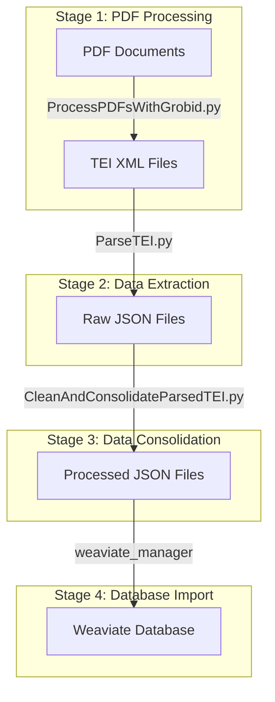

# Scientific Literature Processing Pipeline

This repository contains a comprehensive pipeline for processing scientific literature from PDFs into a structured Weaviate database. The pipeline consists of four main stages: PDF processing, data extraction, data consolidation, and database import.

## Pipeline Overview



## Stage 1: PDF Processing with Grobid

The first stage uses Grobid to convert PDF documents into structured TEI XML format.

### Prerequisites

1. **Grobid Server Setup**
   
   First, ensure Grobid is running on your server:
   ```bash
   podman pull docker.io/grobid/grobid:0.8.1
   podman run --rm --init --ulimit core=0 -p 8070:8070 grobid/grobid:0.8.1 &
   ```

2. **SSH Tunnel Setup (Required)**
   
   > ⚠️ **Important**: You MUST set up an SSH tunnel to access the Grobid server from your local machine.
   
   Set up the tunnel using:
   ```bash
   ssh -L 8070:localhost:8070 username@server
   ```
   For example:
   ```bash
   ssh -L 8070:localhost:8070 aparkin@niya.qb3.berkeley.edu
   ```
   
   Keep this SSH connection open while processing PDFs. If the connection drops, you'll need to:
   1. Re-establish the SSH tunnel
   2. Verify the Grobid server is still running on the remote machine
   3. Resume processing

3. **Verify Connection**
   
   After setting up the tunnel, verify the connection by accessing:
   ```
   http://localhost:8070
   ```
   You should see the Grobid web interface.

### Configuration

Create a `config.json` file:
```json
{
    "grobid_server": "http://localhost:8070",
    "batch_size": 100,
    "sleep_time": 20,
    "timeout": 200,
    "coordinates": [
        "persName",
        "figure",
        "ref",
        "biblStruct",
        "formula",
        "s",
        "p",
        "note",
        "title",
        "affliation",
        "header"
    ]
}
```

### Usage

```bash
python ProcessPDFsWithGrobid.py <input_directory> <output_directory> [--config_path config.json] [--batch_size N]
```

#### Parameters
- `input_directory`: Directory containing PDF files to process
- `output_directory`: Directory to save the TEI XML output
- `--config_path`: Path to configuration file (default: config.json)
- `--batch_size`: Number of files to process in each batch

#### Output
- TEI XML files containing structured document information including:
  - Document metadata
  - Author information
  - References
  - Section content
  - Figures and tables

## Stage 2: TEI XML Processing

The second stage extracts structured information from the TEI XML files and performs Named Entity Recognition (NER).

### Features
- Extracts structured information from TEI XML
- Performs Named Entity Recognition (NER) for:
  - Genes
  - Bioprocesses
  - Chemicals
  - Organisms
- Processes:
  - Document titles and hierarchies
  - Authors and affiliations
  - Abstract and sections
  - References and citations
  - Figures and tables

### Usage

```bash
ls *.xml | python ParseTEI.py <output_directory> [--workers N]
```

#### Parameters
- `output_directory`: Directory for JSON output files
- `--workers`: Number of parallel workers (default: 1)

#### Output
JSON files containing:
- Document metadata
- Author information with affiliations
- Reference data with full bibliographic details
- Named entities with confidence scores
- Section content with hierarchical structure

## Stage 3: Data Consolidation

The third stage consolidates and normalizes the extracted data, preparing it for database import.

### Features
- Parallel processing of article sections
- Intelligent section classification
- Author name normalization and deduplication
- Reference deduplication and linking
- NER result consolidation
- Progress tracking with nested progress bars

### Usage

```bash
ls data/grobid_output/output/*.json | python CleanAndConsolidateParsedTEI.py --output-dir <output_dir> --workers N
```

#### Parameters
- `--output-dir`: Directory for processed output
- `--workers`: Number of parallel workers

#### Output Files
1. `unified_authors.json`: 
   - Consolidated author information
   - Name variants
   - Email addresses
   - Article and reference appearances

2. `unified_references.json`:
   - Consolidated reference information
   - Linked authors
   - Citation contexts
   - Bibliographic details

3. `unified_ner_objects.json`:
   - Consolidated named entities
   - Entity types and categories
   - Confidence scores
   - Occurrence contexts

4. `processed_articles.json`:
   - Processed article content
   - Classified sections
   - Linked entities
   - Metadata and relationships

## Stage 4: Database Import with Weaviate Manager

The final stage imports the processed data into a Weaviate database for advanced querying and analysis.

### Setup

Clear existing data (if needed):
```bash
python -m weaviate_manager.cli --cleanup --force
```

### Import Process

Basic import with data summary:
```bash
python -m weaviate_manager.cli \
    --input-dir data/grobid_output/processed_output \
    --summarize \
    --import \
    -v
```

For detailed analysis and subset processing:
```bash
python -m weaviate_manager.cli \
    --input-dir data/grobid_output/processed_output \
    --summarize \
    --detail-level full \
    --subset-size 10 \
    --import \
    -v
```

#### Available Parameters
- `--input-dir`: Directory containing processed JSON files
- `--verify`: Verify input files before processing
- `--summarize`: Show data summary
- `--detail-level`: Summary detail level (summary|detailed|full)
- `--subset-size`: Process a subset of articles
- `--seed-article`: Specify seed article for subset selection
- `--import`: Import data to database
- `--cleanup`: Clear existing data
- `--force`: Skip confirmation prompts for cleanup
- `-v`: Verbose output

### Database Operations

Display database information:
```bash
# Show current configuration
python -m weaviate_manager.cli --show config

# Show schema information
python -m weaviate_manager.cli --show schema

# Show schema as ERD diagram
python -m weaviate_manager.cli --show schema --as-diagram

# Show database statistics
python -m weaviate_manager.cli --show stats

# Show detailed database info
python -m weaviate_manager.cli --show info
```

### Query Operations

The CLI supports various search operations:

```bash
# Basic hybrid search
python -m weaviate_manager.cli --query "machine learning"

# Semantic search with minimum score
python -m weaviate_manager.cli \
    --query "CRISPR" \
    --search-type semantic \
    --min-score 0.7

# Hybrid search with custom parameters
python -m weaviate_manager.cli \
    --query "protein folding" \
    --search-type hybrid \
    --alpha 0.5 \
    --limit 20

# Search with result unification
python -m weaviate_manager.cli \
    --query "synthetic biology" \
    --unify
```

#### Query Parameters
- `--query`: Search query text
- `--search-type`: Type of search (semantic|keyword|hybrid)
- `--alpha`: Balance between keyword and vector search (0-1)
- `--min-score`: Minimum score threshold
- `--limit`: Maximum results per collection
- `--unify`: Unify results on articles with cross-references
- `--output-format`: Output format (json|rich)

### Database Features
- Semantic search using OpenAI embeddings
- Keyword (BM25) search
- Hybrid search combining semantic and keyword approaches
- Cross-reference exploration
- Entity relationship analysis
- Statistical analysis tools
- Data validation and consistency checks

## Complete Pipeline Example

Here's an example of running the complete pipeline:

```bash
# 1. Start Grobid server
podman run --rm --init --ulimit core=0 -p 8070:8070 grobid/grobid:0.8.1 &

# 2. Process PDFs
python ProcessPDFsWithGrobid.py \
    input_pdfs/ \
    grobid_output/ \
    --batch_size 50

# 3. Extract data
ls grobid_output/*.xml | python ParseTEI.py \
    parsed_output/ \
    --workers 4

# 4. Consolidate data
ls parsed_output/*.json | python CleanAndConsolidateParsedTEI.py \
    --output-dir processed_output/ \
    --workers 4

# 5. Import to database
python -m weaviate_manager.cli \
    --input-dir processed_output/ \
    --verify \
    --summarize \
    --detail-level full \
    --import \
    --cleanup \
    --force \
    -v
```

## Error Handling and Logging

The system includes comprehensive error handling and logging:

### Log Files
- `weaviate_import.log`: Detailed processing and import logs
  - DEBUG level logging for troubleshooting
  - Timestamps and contextual information
  - Error traces and warnings

### Console Output
- INFO/WARNING level messages by default
- Detailed progress with -v flag
- Error messages and warnings
- Processing statistics

### Validation
- Input file verification
- Schema validation
- Data consistency checks
- Cross-reference validation

## Requirements

- Python 3.7+
- Grobid server
- Required Python packages:
  - openai
  - tqdm
  - lxml
  - transformers
  - weaviate-client
  - unidecode

## Contributing

Please see CONTRIBUTING.md for guidelines on how to contribute to this project.

## License

This project is licensed under the MIT License - see the LICENSE file for details. 