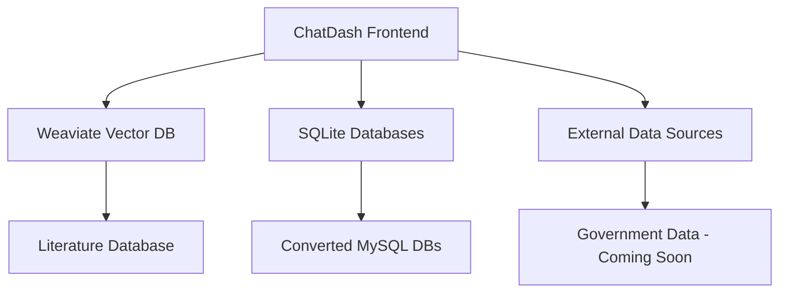

# ChatDash

ChatDash is an integrated system for interactive data exploration and analysis through a chat interface. It provides a unified frontend for querying and analyzing data from multiple sources, including vector databases and SQL databases. The system is designed to prototype natural language driven data integration, harmonization, visualization and analysis with provenance tracking.

## System Overview



## Using ChatDash

### Starting the Application
1. Launch the application:
```bash
python ChatDash.py
```

2. Access the interface in your browser:
```
http://0.0.0.0:8051
```

### Key Features

#### Database Connection
- Use the dropdown and connect button in the upper right
- Database indexing status is shown via an indicator
- Click on database table to view schema (tabular and graphical form)
- Weaviate connection status indicators:
  - Connection status (circle icon): Shows if Weaviate is connected
    - Green: Connected successfully
    - Orange: Connection error
    - Gray: Disconnected
  - Collection status (database icon): Shows literature collection availability
    - Green: Collections available
    - Orange: Missing or misconfigured collections
    - Gray: Collections unavailable
  - Hover over icons for detailed status messages

#### Data Management
- Drop or upload TSV/ZIP archives using the drop pane
- Data files appear as tablets on the left side
- Supported formats: CSV, TSV, and ZIP (containing CSV/TSV)
- Click '×' to delete datasets
- Monitor memory usage in status bar
- Click a tablet to:
  - Select it for chat interaction
  - View data snippet in preview pane
  - See statistical summary in statistics page
- Dataset cards auto-trigger relevant queries when clicked

#### Chat Interface
- Select your preferred LLM using the dropdown
- Type messages in the text area
- Press Enter to send (Shift+Enter for new line)
- Real-time response with data previews and visualizations
- Dataset names are clickable to auto-generate queries

#### Chat Commands and Interactions

##### Data Exploration
- "Tell me about my datasets" - Get a summary of all available datasets
- "Tell me about my dataset" - Information about currently selected dataset
- "Tell me about dataset_name" - Get information about a specific dataset
- "Tell me about the connected database" - Explore database structure and contents
- Use natural language to ask questions about your data
- Reference specific columns using `backticks` when needed

##### MONet Soil Database
- Query the MONet soil database using:
  - Natural language: `monet: [your question]`
  - Direct JSON queries:
    ```monet
    {
      "filters": [{
        "column_name": [
          {"operation": "range", "value": [min, max]},
          {"operation": ">=", "value": number}
        ]
      }],
      "geo_point": {
        "latitude": float,
        "longitude": float,
        "radius_km": float
      }
    }
    ```
  - Execute queries: `monet.search [query_id]`
  - Convert to dataset: `convert [query_id] to dataset`
  - Service info: `tell me about monet`
- Filter operations:
  - Numeric: >, <, >=, <=, ==, range
  - Text: contains, exact, starts_with
  - Date: range, >, <, ==
- Geographic constraints:
  - Point with radius search
  - Bounding box search

##### NMDC Microbiome Data
- Access NMDC API data through:
  - Natural language: `nmdc: [your question]`
  - Direct JSON queries:
    ```nmdc
    {
      "endpoint": "/biosamples",
      "filter": "env_broad_scale=ocean and latitude>45"
    }
    ```
  - Execute queries: `nmdc.search [query_id]`
  - Convert to dataset: `convert [query_id] to dataset`
  - Service info: `tell me about nmdc`
- Common endpoints:
  - /biosamples - Search biological samples and metadata
  - /studies - Search research studies and protocols
  - /data_objects - Search associated data files
- Features:
  - Standardized metadata representation
  - Cross-study data integration
  - Biological data accessibility

##### USGS Water Quality Data
- Access nationwide water quality monitoring data through:
  - Natural language: `usgs_water: [your question]`
  - Parameter search: `usgs_water.parameters [search term]`
  - Execute queries: `usgs_water.search [query_id]`
  - Convert to dataset: `convert [query_id] to dataset`
  - Service info: `tell me about usgs_water`
- Data coverage:
  - Nationwide USGS monitoring network
  - 3000+ water quality parameters
  - Historical and real-time data
  - USGS certified measurements
- Features:
  - Geographic site location search
  - Time-series data retrieval and analysis
  - Parameter metadata and search
  - Comprehensive data statistics
  - Interactive dataset conversion

##### Literature Search
- Search scientific literature using natural language:
  - "What is known about gene regulation?"
  - "Find papers about CRISPR"
  - "Search for articles related to metabolic pathways"
- Refine search results:
  - Use "refine lit_query_XXXXXXXX_XXXXXX with threshold 0.X"
  - Example: "refine lit_query_20250207_123456 with threshold 0.7"
  - Higher thresholds (0.7-0.9) give more relevant but fewer results
  - Lower thresholds (0.3-0.5) give more results but may be less relevant
- Convert literature results to datasets:
  - "convert lit_query_XXXXXXXX_XXXXXX to dataset"
  - Creates a new dataset with search results for further analysis

##### SQL Queries and Database Operations
- First, select your database using the dropdown at the top of Data Management
- View database structure in the Database tab under Dataset Info
- Write natural language queries that get converted to SQL
- Execute queries in multiple ways:
  - Simple: Type "execute." to run the last query
  - Specific: "execute query_20240315_123456_original" for a particular query
  - Note: Valid execution commands run immediately
- Convert query results to datasets:
  - "convert query_20240315_123456_original to dataset"
- Combine SQL query results with uploaded data

##### Visualization Commands
Important: First select a dataset by clicking its name in the dataset browser.

1. Bubble Plots:
   ```
   plot [y_column] vs [x_column]
   ```
   Optional parameters:
   - size=[number or column_name]
   - color=[color_name or column_name]
   * For column-based color: numeric columns create continuous scales, categorical columns create discrete legends

2. Heatmaps:
   ```
   heatmap columns=[col1,col2,col3]
   ```
   Required:
   - columns=[col1,col2,...] or columns=regex_pattern
   
   Optional:
   - rows=[row1,row2,...] or rows=regex_pattern fcol=filter_column
   - standardize=rows|columns
   - cluster=rows|columns|both
   - colormap=[valid_plotly_colormap]
   - transpose=true|false

   Note: When using regex patterns with rows, fcol must specify which column to filter on

3. Geographic Maps:
   ```
   map latitude=[lat_column] longitude=[lon_column]
   ```
   Required:
   - latitude=[column_name]
   - longitude=[column_name]
   
   Optional:
   - size=[number or column_name]
   - color=[color_name or column_name]
   * Numeric color columns show colorbar, categorical show legend

#### Visualization Features
All visualizations include:
- Interactive controls:
  * Pan: Click and drag
  * Zoom: Mouse wheel or pinch gestures
  * Reset: Double-click
  * Export: High-quality PNG via camera icon
  * Tooltips: Hover for detailed values
  * Modebar: Additional tools and options

Visualization Types:

##### Bubble Plots
- 2D scatter plots with customizable:
  * Axes and labels
  * Point sizes (static or data-driven)
  * Colors (continuous for numeric, discrete for categorical)

##### Maps
- Geographical visualization with:
  * Automatic zoom based on coordinate spread
  * Dynamic point sizing
  * Color mapping (colorbar for numeric, legend for categorical)
  * Automatic invalid coordinate filtering

##### Heatmaps
- Matrix visualization featuring:
  * Flexible data selection (explicit lists or regex patterns)
  * Row/column standardization
  * Hierarchical clustering with optimal ordering
  * Customizable colormaps
  * Optional transposition

#### Data Analysis Features
- Preview: First few rows of datasets
- Statistics: Detailed profiling reports
- Visualization: Interactive plots and charts
- SQL Query: Natural language to SQL conversion

## Components

### 1. ChatDash Frontend (`ChatDash.py`)
A Plotly Dash-based web application running on port 8051 that provides:
- Interactive chat interface
- Dataset management and visualization
- Database connection and querying
- Real-time data analysis

### 2. Data Sources

#### Literature Database (Weaviate)
- Managed through `weaviate_manager` CLI tool
- Processes academic papers using GROBID pipeline
- Supports semantic search and complex queries
- [See detailed documentation](CreatingTheLiteratureDatabase.md)

#### SQLite Databases
- Store in `data/` directory
- Convert from MySQL using provided `mysql2sqlite` tool
- Support standard SQL queries and joins

#### Government Database (Coming Soon)
- Integration planned for government data sources
- Details and implementation to be determined

## Getting Started

### Prerequisites
- Python 3.7+
- Weaviate instance for vector database
- SQLite for relational databases

### Environment Setup
1. Create and activate a virtual environment:
```bash
python -m venv venv
source venv/bin/activate  # On Windows: venv\Scripts\activate
```

2. Install dependencies:
```bash
pip install -r requirements.txt
```

3. Create a `.env` file with required credentials:
```env
OPENAI_API_KEY=your_key_here
OPENAI_BASE_URL=https://api.openai.com  # or your custom endpoint
```

### Database Setup

#### Literature Database
Follow the [Literature Database Setup Guide](CreatingTheLiteratureDatabase.md) for:
- Setting up GROBID for PDF processing
- Processing academic papers
- Importing to Weaviate

#### SQLite Databases
1. Place SQLite databases in the `data/` directory
2. To convert MySQL databases:
```bash
# Convert MySQL dump to SQLite
./data/mysql2sqlite dump_mysql.sql > output.sql
# Import into SQLite
sqlite3 data/your_database.db < output.sql
```

## Usage

### Using weaviate_manager
The `weaviate_manager` package provides both a CLI and programmatic interface for managing and querying the literature database.

#### CLI Usage
```bash
# Show database information
python -m weaviate_manager.cli --show info

# Perform a search
python -m weaviate_manager.cli --query "your query" --search-type hybrid
```

#### Programmatic Usage
```python
from weaviate_manager.query import QueryManager

# Initialize query manager
query_manager = QueryManager(client)

# Perform a search
results = query_manager.comprehensive_search(
    query_text="your query",
    search_type="hybrid",
    limit=10
)
```

## Contributing
Guidelines for contributing to be added.

## License
License information to be added.