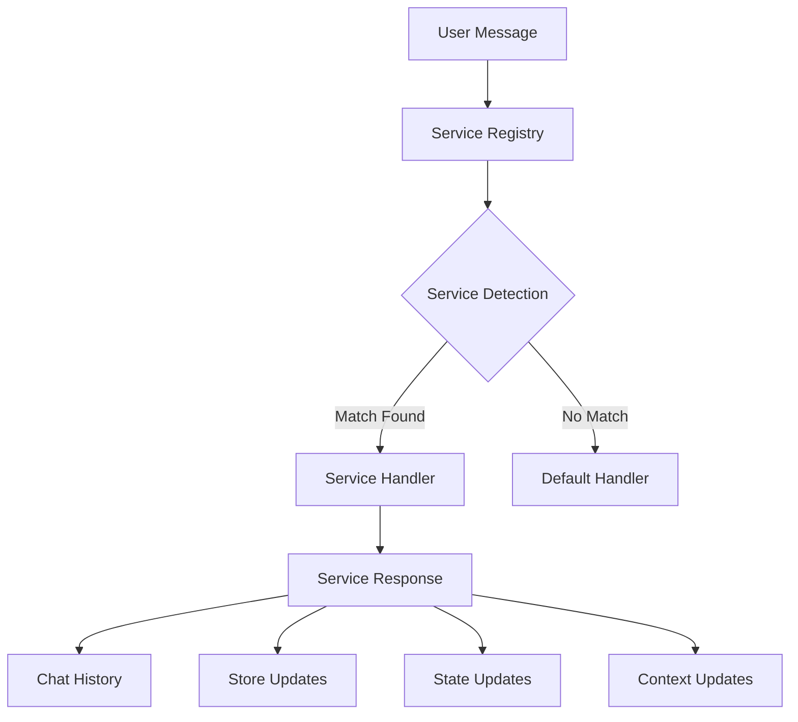

# ChatDash Service System

## Overview

The ChatDash Service System provides a modular, extensible architecture for handling specialized chat interactions. Each service is a self-contained module that can process specific types of requests, manage its own state, and integrate with the broader ChatDash system.

## Core Concepts

### Service Architecture



### Key Components

1. **Service Registry**: Central hub that manages all available services
2. **Service Classes**: Individual implementations of the `ChatService` base class
3. **Message Flow**:
   - Message received → Service detection → Handler execution → Response generation
4. **Response Types**:
   - Chat messages
   - Store updates
   - State updates
   - Context for LLM

## Implementing a Service

### Basic Structure

```python
from .base import ChatService, ServiceResponse, ServiceMessage, ServiceContext

class MyNewService(ChatService):
    def __init__(self):
        super().__init__("service_name")
        # Register any required prefixes
        PreviewIdentifier.register_prefix("my_prefix")
    
    def can_handle(self, message: str) -> bool:
        # Determine if this service should handle the message
        pass
        
    def parse_request(self, message: str) -> Dict[str, Any]:
        # Extract parameters from the message
        pass
        
    def execute(self, params: Dict[str, Any], context: Dict[str, Any]) -> ServiceResponse:
        # Execute the service logic
        pass
```

### Core Requirements

1. **Unique Identity**:
   - Each service must have a unique name
   - Any ID prefixes must be registered via `PreviewIdentifier`

2. **Message Detection**:
   - `can_handle` must efficiently determine applicability
   - Avoid expensive operations in detection phase
   - Pattern matching should be precise and documented

3. **Parameter Extraction**:
   - `parse_request` should handle all parameter variations
   - Validate parameters before execution
   - Return standardized parameter dictionary

4. **Execution**:
   - Handle all error cases gracefully
   - Provide informative error messages
   - Update stores and state consistently

## Best Practices

### 1. Message Handling

- Use clear, documented regex patterns for message detection
- Support variations in user phrasing
- Handle edge cases and malformed input gracefully

### 2. State Management

- Keep service state minimal and well-documented
- Use the store system for persistent data
- Document any state dependencies

### 3. Response Formatting

- Use markdown for message formatting
- Include clear action instructions
- Maintain consistent styling across services

### 4. Error Handling

- Provide user-friendly error messages
- Include debugging information where appropriate
- Maintain system stability during errors

### 5. Code Organization

- Break complex services into logical private methods
- Document method purposes and parameters
- Follow consistent naming conventions

## Service Integration Guidelines

### 1. Registration

```python
# In services/__init__.py
from .my_service import MyNewService
registry.register(MyNewService())
```

### 2. Store Updates

```python
store_updates = {
    'unique_id': {
        'data': data,
        'metadata': {
            'timestamp': datetime.now().strftime('%Y-%m-%d %H:%M:%S'),
            'type': 'my_service_data'
        }
    }
}
```

### 3. Context Generation

```python
context = ServiceContext(
    source=self.name,
    data={
        'key_info': value,
        'status': status
    },
    metadata={
        'analysis_prompts': [
            "Specific instructions for LLM analysis",
            "Points to consider in response"
        ]
    }
)
```

## Testing Services

### 1. Unit Testing

- Test message detection patterns
- Verify parameter extraction
- Validate response formatting
- Check error handling

### 2. Integration Testing

- Verify store updates
- Test context generation
- Check service interactions
- Validate end-to-end flows

## Common Patterns

### 1. ID Generation

```python
# Register prefix in __init__
PreviewIdentifier.register_prefix("my_prefix")

# Generate IDs
new_id = PreviewIdentifier.create_id(prefix="my_prefix")
alt_id = PreviewIdentifier.create_id(previous_id=original_id)
```

### 2. Response Building

```python
return ServiceResponse(
    messages=[
        ServiceMessage(
            service=self.name,
            content="Operation successful",
            message_type="info",
            role="assistant"
        )
    ],
    context=context,
    store_updates=updates,
    state_updates=state_changes
)
```

### 3. Error Responses

```python
return ServiceResponse(
    messages=[
        ServiceMessage(
            service=self.name,
            content=f"❌ Error: {error_message}",
            message_type="error",
            role="assistant"
        )
    ],
    context=None
)
```

## Service Lifecycle

1. **Initialization**:
   - Register service with unique name
   - Register any required prefixes
   - Initialize any required resources

2. **Message Processing**:
   - Detect applicability
   - Parse parameters
   - Execute logic
   - Generate response

3. **Cleanup**:
   - Update stores
   - Update state
   - Provide context for next interaction

## Principles

1. **Single Responsibility**:
   - Each service should handle one type of interaction
   - Break complex services into smaller, focused ones

2. **Consistency**:
   - Follow established patterns for ID generation
   - Maintain consistent response formatting
   - Use standard error handling approaches

3. **User Experience**:
   - Provide clear, actionable feedback
   - Handle errors gracefully
   - Guide users through multi-step processes

4. **Maintainability**:
   - Document service behavior and requirements
   - Use clear, consistent code structure
   - Follow established naming conventions

5. **Extensibility**:
   - Design for future enhancements
   - Allow for service composition
   - Maintain clean interfaces

## Example Services

See existing implementations for reference:
- `LiteratureService`: Complex search and refinement
- `StoreReportService`: Simple reporting and analysis

## Contributing

When adding new services:
1. Follow the established patterns
2. Document your service thoroughly
3. Add appropriate tests
4. Update this documentation as needed 