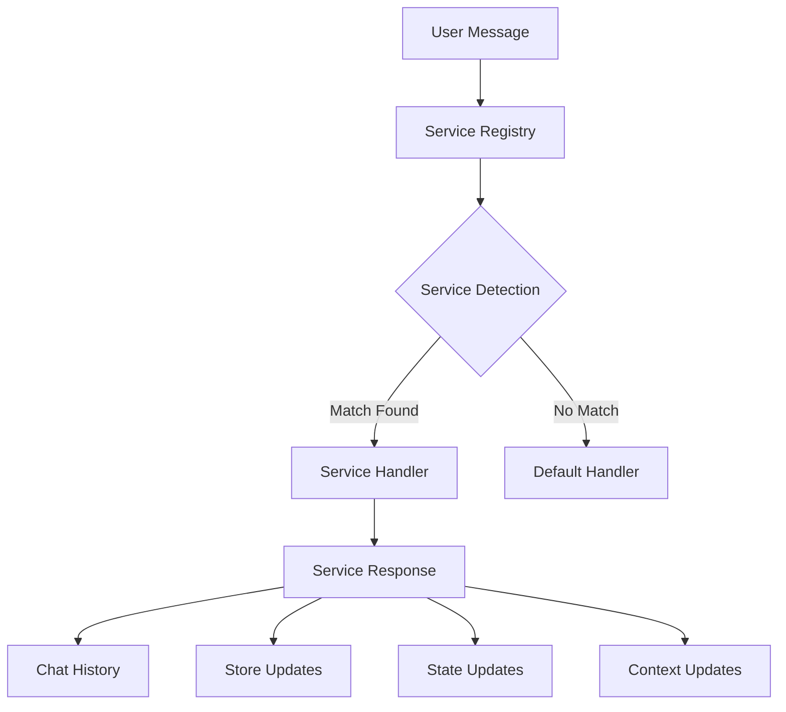

# ChatDash Service System

## Overview

The ChatDash Service System provides a modular, extensible architecture for handling specialized chat interactions. Each service is a self-contained module that can process specific types of requests, manage its own state, and integrate with the broader ChatDash system.

## Core Concepts

### Service Architecture



### Key Components

1. **Service Registry**: Central hub that manages all available services
2. **Service Classes**: Individual implementations of the `ChatService` base class
3. **Message Flow**:
   - Message received → Service detection → Handler execution → Response generation
4. **Response Types**:
   - Chat messages
   - Store updates
   - State updates
   - Context for LLM

## Implementing a Service

### Basic Structure

```python
from .base import ChatService, ServiceResponse, ServiceMessage, ServiceContext

class MyNewService(ChatService):
    def __init__(self):
        super().__init__("service_name")
        # Register any required prefixes
        PreviewIdentifier.register_prefix("my_prefix")
    
    def can_handle(self, message: str) -> bool:
        # Determine if this service should handle the message
        pass
        
    def parse_request(self, message: str) -> Dict[str, Any]:
        # Extract parameters from the message
        pass
        
    def execute(self, params: Dict[str, Any], context: Dict[str, Any]) -> ServiceResponse:
        # Execute the service logic
        pass
```

### Core Requirements

1. **Unique Identity**:
   - Each service must have a unique name
   - Any ID prefixes must be registered via `PreviewIdentifier`

2. **Message Detection**:
   - `can_handle` must efficiently determine applicability
   - Avoid expensive operations in detection phase
   - Pattern matching should be precise and documented

3. **Parameter Extraction**:
   - `parse_request` should handle all parameter variations
   - Validate parameters before execution
   - Return standardized parameter dictionary

4. **Execution**:
   - Handle all error cases gracefully
   - Provide informative error messages
   - Update stores and state consistently

## Best Practices

### 1. Message Handling

- Use clear, documented regex patterns for message detection
- Support variations in user phrasing
- Handle edge cases and malformed input gracefully

### 2. State Management

- Keep service state minimal and well-documented
- Use the store system for persistent data
- Document any state dependencies

### 3. Response Formatting

- Use markdown for message formatting
- Include clear action instructions
- Maintain consistent styling across services

### 4. Error Handling

- Provide user-friendly error messages
- Include debugging information where appropriate
- Maintain system stability during errors

### 5. Code Organization

- Break complex services into logical private methods
- Document method purposes and parameters
- Follow consistent naming conventions

## Service Integration Guidelines

### 1. Registration

```python
# In services/__init__.py
from .my_service import MyNewService
registry.register(MyNewService())
```

### 2. Store Updates

```python
store_updates = {
    'unique_id': {
        'data': data,
        'metadata': {
            'timestamp': datetime.now().strftime('%Y-%m-%d %H:%M:%S'),
            'type': 'my_service_data'
        }
    }
}
```

### 3. Context Generation

```python
context = ServiceContext(
    source=self.name,
    data={
        'key_info': value,
        'status': status
    },
    metadata={
        'analysis_prompts': [
            "Specific instructions for LLM analysis",
            "Points to consider in response"
        ]
    }
)
```

## Testing Services

### 1. Unit Testing

- Test message detection patterns
- Verify parameter extraction
- Validate response formatting
- Check error handling

### 2. Integration Testing

- Verify store updates
- Test context generation
- Check service interactions
- Validate end-to-end flows

## Common Patterns

### 1. ID Generation

```python
# Register prefix in __init__
PreviewIdentifier.register_prefix("my_prefix")

# Generate IDs
new_id = PreviewIdentifier.create_id(prefix="my_prefix")
alt_id = PreviewIdentifier.create_id(previous_id=original_id)
```

### 2. Response Building

```python
return ServiceResponse(
    messages=[
        ServiceMessage(
            service=self.name,
            content="Operation successful",
            message_type="info",
            role="assistant"
        )
    ],
    context=context,
    store_updates=updates,
    state_updates=state_changes
)
```

### 3. Error Responses

```python
return ServiceResponse(
    messages=[
        ServiceMessage(
            service=self.name,
            content=f"❌ Error: {error_message}",
            message_type="error",
            role="assistant"
        )
    ],
    context=None
)
```

## Service Lifecycle

1. **Initialization**:
   - Register service with unique name
   - Register any required prefixes
   - Initialize any required resources

2. **Message Processing**:
   - Detect applicability
   - Parse parameters
   - Execute logic
   - Generate response

3. **Cleanup**:
   - Update stores
   - Update state
   - Provide context for next interaction

## Principles

1. **Single Responsibility**:
   - Each service should handle one type of interaction
   - Break complex services into smaller, focused ones

2. **Consistency**:
   - Follow established patterns for ID generation
   - Maintain consistent response formatting
   - Use standard error handling approaches

3. **User Experience**:
   - Provide clear, actionable feedback
   - Handle errors gracefully
   - Guide users through multi-step processes

4. **Maintainability**:
   - Document service behavior and requirements
   - Use clear, consistent code structure
   - Follow established naming conventions

5. **Extensibility**:
   - Design for future enhancements
   - Allow for service composition
   - Maintain clean interfaces

## Current Services

The ChatDash system includes the following services:

1. **LiteratureService**
   - Scientific literature search and analysis
   - Vector-based semantic search
   - Result refinement with adjustable thresholds
   - Dataset conversion capabilities

2. **DatabaseService**
   - SQL query handling and execution
   - Schema introspection and management
   - Result processing and formatting
   - Natural language to SQL conversion

3. **NMDCService**
   - Microbiome data access and integration
   - API integration with NMDC endpoints
   - Query building and parameter handling
   - Standardized metadata representation

4. **UniProtService**
   - Protein data querying and analysis
   - Sequence and structure information
   - Biological context and annotations
   - Cross-reference management

5. **USGSWaterService**
   - Water quality data access and analysis
   - Geographic site location search
   - Time-series data retrieval
   - Parameter metadata and search
   - Dataset conversion capabilities

6. **StoreReportService**
   - Data store reporting and analysis
   - Status monitoring and diagnostics
   - Usage statistics and summaries

7. **MONetService**
   - Soil microbiome data access
   - Geographic search capabilities
   - Filter-based query construction
   - Data visualization support

8. **IndexService**
   - Database schema indexing
   - Table and column metadata extraction
   - Relationship mapping
   - Schema visualization support

9. **VisualizationService**
   - Interactive data visualization
   - Chart and graph generation
   - Geographic mapping
   - Custom visualization parameters
   - Multi-dataset visualization

10. **DatasetService**
    - Dataset creation and management
    - Data transformation and filtering
    - Profile report generation
    - Dataset conversion and export
    - Cross-dataset operations

## Available Services

### NMDC Enhanced Service
The NMDC Enhanced Service provides advanced data discovery and analysis capabilities for the National Microbiome Data Collaborative (NMDC) database. It enables researchers to explore environmental microbiome data through:

- Natural language querying
- Direct SQL querying with DuckDB syntax
- Advanced data integration across studies and biosamples
- Statistical analysis and result summarization
- Geographic and environmental context analysis
- Dataset management and conversion

Key Features:
1. **Dual Query Interface**:
   - Natural language: `nmdc_enhanced: [question]`
   - Direct SQL: ```nmdc_enhanced [query]```

2. **Rich Data Context**:
   - Unified view of studies and biosamples
   - Environmental and geographic metadata
   - Physical measurements and parameters
   - Omics data availability

3. **Advanced Analysis**:
   - Statistical summaries
   - Geographic distribution analysis
   - Environmental pattern detection
   - Result visualization

4. **Data Management**:
   - Query result storage
   - Dataset conversion
   - Profile report generation

Example Usage:
#### Natural language query
```python
nmdc_enhanced: Find soil samples from Washington state with high carbon content
```
#### Direct SQL query
```nmdc_enhanced
SELECT *
FROM unified
WHERE ecosystem = 'soil'
AND geo_loc_name LIKE '%Washington%'
AND "tot_org_carb.has_numeric_value" > 5.0
```

## Contributing

When adding new services:
1. Follow the established patterns
2. Document your service thoroughly
3. Add appropriate tests
4. Update this documentation as needed

## Service Creation Pattern: Lessons from MONet

The MONet service implementation demonstrates the complete requirements for creating a robust ChatDash service. This guide provides a systematic approach to service implementation.

### Critical Base Requirements

1. **Service Class Structure**:
   ```python
   class NewService(ChatService, LLMServiceMixin):
       def __init__(self):
           ChatService.__init__(self, "service_name")
           LLMServiceMixin.__init__(self, "service_name")
           
           # REQUIRED: Register unique prefix for query IDs
           try:
               PreviewIdentifier.register_prefix("service_name_query")
           except ValueError:
               pass  # Handle if already registered
           
           # REQUIRED: Define regex patterns for command detection
           self.query_block_pattern = r'```service_name\s*(.*?)```'
           self.execution_patterns = [
               r'^service\.search\s+(?:service_name_query_)?\d{8}_\d{6}(?:_orig|_alt\d+)\b',
               r'^service\.(?:search|query)\.?$',
               r'tell\s+me\s+about\s+service_name\b',
               r'^convert\s+service_name_query_\d{8}_\d{6}(?:_orig|_alt\d+)\s+to\s+dataset\b'
           ]
           
           # Compile patterns for efficiency
           self.query_block_re = re.compile(self.query_block_pattern, re.DOTALL)
           self.execution_res = [re.compile(p, re.IGNORECASE) for p in self.execution_patterns]
   ```

2. **Required Base Methods**:
   ```python
   def can_handle(self, message: str) -> bool:
       """REQUIRED: Efficient message detection."""
       message = message.strip()
       
       # Check for service blocks
       if self.query_block_re.search(message):
           return True
           
       # Check for execution commands
       return any(pattern.search(message) for pattern in self.execution_res)
   
   def parse_request(self, message: str) -> Dict[str, Any]:
       """REQUIRED: Standardized request parsing."""
       message = message.strip()
       
       # REQUIRED: Handle all command types
       if match := self.query_block_re.search(message):
           return {
               'type': 'direct_query',
               'query': self._parse_query_block(match.group(1))
           }
       
       # REQUIRED: Handle execution commands
       if match := re.match(r'^service\.search\s+(service_name_query_\d{8}_\d{6}(?:_orig|_alt\d+))', message):
           return {
               'type': 'execute_query',
               'query_id': match.group(1)
           }
       
       raise ValueError(f"Unable to parse request: {message}")
   
   def execute(self, request: Dict[str, Any], context: Dict[str, Any]) -> ServiceResponse:
       """REQUIRED: Main execution logic."""
       try:
           # REQUIRED: Store context for LLM
           self.context = context
           
           if request['type'] == 'direct_query':
               return self._handle_direct_query(request['query'], context)
           elif request['type'] == 'execute_query':
               return self._handle_query_execution(request['query_id'], context)
           # ... handle other types ...
           
       except Exception as e:
           return ServiceResponse(
               messages=[ServiceMessage(
                   service=self.name,
                   content=f"Error: {str(e)}",
                   message_type=MessageType.ERROR
               )]
           )
   ```

3. **Required Dataset Conversion**:
   ```python
   def _handle_dataset_conversion(self, query_id: str, context: Dict[str, Any]) -> ServiceResponse:
       """REQUIRED: Handle conversion to dataset with profile."""
       try:
           # Get stored query
           stored = context.get('successful_queries_store', {}).get(query_id)
           if not stored:
               raise ValueError(f"No stored query found: {query_id}")
           
           # Re-execute query for fresh results
           results = self._execute_query(stored['query'])
           
           # REQUIRED: Generate profile report
           profile = ProfileReport(
               results,
               title=f"Profile Report for {query_id}",
               minimal=True,
               html={'style': {'full_width': True}},
               progress_bar=False,
               correlations={'pearson': {'calculate': True}},
               missing_diagrams={'matrix': False},
               samples=None
           )
           
           # REQUIRED: Create dataset entry
           dataset_entry = {
               'df': results.to_dict('records'),
               'metadata': {
                   'source': f"Service Query {query_id}",
                   'creation_time': datetime.now().strftime('%Y-%m-%d %H:%M:%S'),
                   'query': stored['query'],
                   'rows': len(results),
                   'columns': list(results.columns)
               },
               'profile_report': profile.to_html()
           }
           
           return ServiceResponse(
               messages=[ServiceMessage(
                   service=self.name,
                   content=f"✓ Converted to dataset: {query_id}",
                   message_type=MessageType.INFO
               )],
               store_updates={'datasets_store': {query_id: dataset_entry}}
           )
           
       except Exception as e:
           return ServiceResponse(
               messages=[ServiceMessage(
                   service=self.name,
                   content=f"Conversion failed: {str(e)}",
                   message_type=MessageType.ERROR
               )]
           )
   ```

### Service Layer Architecture

The service should be organized into these layers:

1. **Service Layer** (`service.py`):
   - Main service class implementation
   - Command detection and routing
   - Query tracking and execution
   - Response formatting
   - LLM integration

2. **Data Layer** (`data_manager.py`):
   - Data fetching and caching
   - Data validation
   - Transformation tracking
   - Consistency management

3. **Query Layer** (`query_builder.py`):
   - Query validation
   - Query execution
   - Result formatting
   - Query optimization

4. **Support Components**:
   - `models.py`: Data structures and types
   - `query_context.py`: Query history and state
   - `prompts.py`: LLM prompt templates

### Critical Implementation Details

1. **Query ID Management**:
   ```python
   def add_ids_to_blocks(self, text: str) -> str:
       """REQUIRED: Add query IDs to code blocks."""
       if '```service_name' not in text:
           return text
           
       def replace_block(match):
           block = match.group(1).strip()
           if '--' in block and 'Query ID:' in block:
               return match.group(0)
               
           try:
               # Validate query structure
               query = json.loads(block)
               
               # Generate new ID
               query_id = PreviewIdentifier.create_id(prefix="service_name_query")
               
               # Format block with ID
               return f"```service_name\n{block}\n\n-- Query ID: {query_id}\n```"
           except json.JSONDecodeError:
               return match.group(0)
               
       return re.sub(
           self.query_block_pattern,
           replace_block,
           text,
           flags=re.DOTALL
       )
   ```

2. **Result Preview Generation**:
   ```python
   def _format_preview(self, result: QueryResult, query_id: str) -> str:
       """REQUIRED: Format query results preview."""
       df = result.dataframe
       
       # Select preview columns
       preview_cols = self._select_preview_columns(df)
       
       # Format preview DataFrame
       preview_df = df[preview_cols].head()
       formatted_df = self._format_preview_values(preview_df)
       
       return f"""### Query Results

Total rows: {len(df)}
Total columns: {len(df.columns)}

Preview:
{formatted_df.to_markdown(index=False)}

To convert to dataset: convert {query_id} to dataset"""
   ```

3. **LLM Integration**:
   ```python
   def summarize(self, content: Union[pd.DataFrame, str], 
                chat_history: List[Dict[str, Any]]) -> str:
       """REQUIRED: Generate content summaries."""
       try:
           if isinstance(content, pd.DataFrame):
               # Get statistics about the DataFrame
               stats = self._format_results_stats(content)
               
               # Get LLM interpretation
               prompt_context = {
                   'results_stats': stats,
                   'chat_history': self._format_chat_history(chat_history)
               }
               
               response = self._call_llm(
                   messages=[{'role': 'user', 'content': 'Summarize this data'}],
                   system_prompt=load_prompt('results', prompt_context)
               )
               
               # Add query IDs to any suggestions
               return self.add_ids_to_blocks(response)
           else:
               # Handle text content
               return self._summarize_text(content, chat_history)
               
       except Exception as e:
           return f"Error generating summary: {str(e)}"
   ```

### Integration Requirements

1. **Service Registration**:
   ```python
   # REQUIRED: In services/__init__.py
   from .new_service import NewService
   service = NewService()
   registry.register(service)
   ```

2. **Documentation Requirements**:
   - Complete docstrings for all public methods
   - Command reference in help text
   - LLM prompt additions
   - Usage examples in README

3. **Testing Requirements**:
   - Interactive test script
   - Systematic test suite
   - Command pattern tests
   - Error handling tests

This comprehensive pattern ensures that new services meet all system requirements while maintaining consistency and reliability.

# ChatDash Service Development Guide

This guide explains how to create new services for ChatDash using the provided template and best practices learned from existing implementations.

## Service Architecture

ChatDash services follow a consistent architecture with these key components:

1. **Base Classes**
   - `ChatService`: Core service functionality
   - `LLMServiceMixin`: LLM integration capabilities

2. **Required Implementations**
   ```python
   class MyService(ChatService, LLMServiceMixin):
       def __init__(self):
           ChatService.__init__(self, "my_service")
           LLMServiceMixin.__init__(self, "my_service")
   ```

3. **Message Flow**
   ```
   User Message → can_handle() → parse_request() → execute() → ServiceResponse
                                     ↓
                            LLM Processing (if needed)
                            process_message()
                            summarize()
   ```

## Creating a New Service

1. **Copy the Template**
   - Start with `template_service.py`
   - Rename class and update service name
   - Customize request types for your service

2. **Required Methods**
   ```python
   def can_handle(self, message: str) -> bool:
       """Efficient message detection."""
       message = message.strip()
       
       # Check for service blocks
       if self.query_block_re.search(message):
           return True
           
       # Check for execution commands
       return any(pattern.search(message) for pattern in self.execution_res)
   
   def parse_request(self, message: str) -> Dict[str, Any]:
       """Standardized request parsing."""
       message = message.strip()
       
       # REQUIRED: Handle all command types
       if match := self.query_block_re.search(message):
           return {
               'type': 'direct_query',
               'query': self._parse_query_block(match.group(1))
           }
       
       # REQUIRED: Handle execution commands
       if match := re.match(r'^service\.search\s+(service_name_query_\d{8}_\d{6}(?:_orig|_alt\d+))', message):
           return {
               'type': 'execute_query',
               'query_id': match.group(1)
           }
       
       raise ValueError(f"Unable to parse request: {message}")
   
   def execute(self, request: Dict[str, Any], context: Dict[str, Any]) -> ServiceResponse:
       """Main execution logic."""
       try:
           # REQUIRED: Store context for LLM
           self.context = context
           
           if request['type'] == 'direct_query':
               return self._handle_direct_query(request['query'], context)
           elif request['type'] == 'execute_query':
               return self._handle_query_execution(request['query_id'], context)
           # ... handle other types ...
           
       except Exception as e:
           return ServiceResponse(
               messages=[ServiceMessage(
                   service=self.name,
                   content=f"Error: {str(e)}",
                   message_type=MessageType.ERROR
               )]
           )
   ```

3. **LLM Integration**
   ```python
   def process_message(self, message: str, chat_history: List[Dict]) -> str:
       """Process messages with LLM."""
       # Create focused system prompt
       system_prompt = self._create_system_prompt(chat_history)
       
       # Call LLM with context
       return self._call_llm(
           messages=[
               {"role": "system", "content": system_prompt},
               {"role": "user", "content": message}
           ]
       )
   
   def summarize(self, content: str, chat_history: List[Dict]) -> str:
       """Generate summaries with LLM."""
       prompt = self._create_summary_prompt(content)
       return self._call_llm([{"role": "user", "content": prompt}])
   ```

## Best Practices

1. **Message Handling**
   - Use clear regex patterns for command detection
   - Support both direct and natural language queries
   - Maintain consistent command formats
   - Provide helpful error messages

2. **LLM Integration**
   - Create focused system prompts
   - Maintain relevant context
   - Use consistent temperature settings
   - Handle errors gracefully

3. **State Management**
   - Cache expensive operations (schemas, capabilities)
   - Clear state between requests
   - Use immutable state updates
   - Document state dependencies

4. **Error Handling**
   - Catch and classify errors
   - Provide helpful error messages
   - Maintain service stability
   - Log errors for debugging

5. **Documentation**
   - Clear docstrings for all methods
   - Example usage in class docstring
   - Consistent command documentation
   - Limitations and requirements

## Common Patterns

1. **Query Execution**
   ```python
   def _handle_direct_query(self, query: Dict, context: Dict) -> ServiceResponse:
       try:
           # 1. Validate query
           self._validate_query(query)
           
           # 2. Execute query
           results = self._execute_query(query)
           
           # 3. Process results
           processed = self._process_results(results)
           
           # 4. Generate summary
           summary = self.summarize(processed, context['chat_history'])
           
           # 5. Return response
           return ServiceResponse(
               messages=[
                   ServiceMessage(
                       service=self.name,
                       content=processed,
                       message_type=MessageType.RESULT
                   ),
                   ServiceMessage(
                       service=self.name,
                       content=summary,
                       message_type=MessageType.SUMMARY
                   )
               ]
           )
           
       except Exception as e:
           return ServiceResponse(
               messages=[ServiceMessage(
                   service=self.name,
                   content=f"Error: {str(e)}",
                   message_type=MessageType.ERROR
               )]
           )
   ```

2. **Natural Language Processing**
   ```python
   def _handle_natural_query(self, query: str, context: Dict) -> ServiceResponse:
       try:
           # 1. Process with LLM
           llm_response = self.process_message(query, context['chat_history'])
           
           # 2. Extract executable parts
           executable = self._extract_executable(llm_response)
           
           # 3. Execute and process
           results = self._execute_query(executable)
           processed = self._process_results(results)
           
           # 4. Return with explanation
           return ServiceResponse(
               messages=[
                   ServiceMessage(
                       service=self.name,
                       content=llm_response,
                       message_type=MessageType.INFO
                   ),
                   ServiceMessage(
                       service=self.name,
                       content=processed,
                       message_type=MessageType.RESULT
                   )
               ]
           )
           
       except Exception as e:
           return ServiceResponse(
               messages=[ServiceMessage(
                   service=self.name,
                   content=f"Error: {str(e)}",
                   message_type=MessageType.ERROR
               )]
           )
   ```

## Testing

1. **Unit Tests**
   - Test command detection
   - Test request parsing
   - Test query execution
   - Test error handling

2. **Integration Tests**
   - Test LLM integration
   - Test state management
   - Test error recovery
   - Test performance

3. **Documentation Tests**
   - Test help text
   - Test error messages
   - Test command examples
   - Test limitations

## Configuration

Services can be configured through environment variables:

```bash
# LLM Settings
SERVICE_NAME_MODEL="anthropic/claude-sonnet"
SERVICE_NAME_TEMPERATURE=0.4

# Service-specific settings
SERVICE_NAME_SETTING_1="value1"
SERVICE_NAME_SETTING_2="value2"
```

## Common Issues

1. **Performance**
   - Cache expensive operations
   - Limit context size
   - Use efficient regex
   - Profile critical paths

2. **Stability**
   - Handle all error cases
   - Validate inputs
   - Maintain state correctly
   - Log important events

3. **Usability**
   - Clear error messages
   - Helpful suggestions
   - Consistent formats
   - Good documentation

## Future Improvements

1. **Enhanced LLM Integration**
   - Better context management
   - Improved prompts
   - More efficient token use
   - Better error recovery

2. **Extended Capabilities**
   - More query types
   - Better summaries
   - Enhanced analysis
   - Improved visualization

3. **Better Testing**
   - More test coverage
   - Better error simulation
   - Performance testing
   - Security testing 